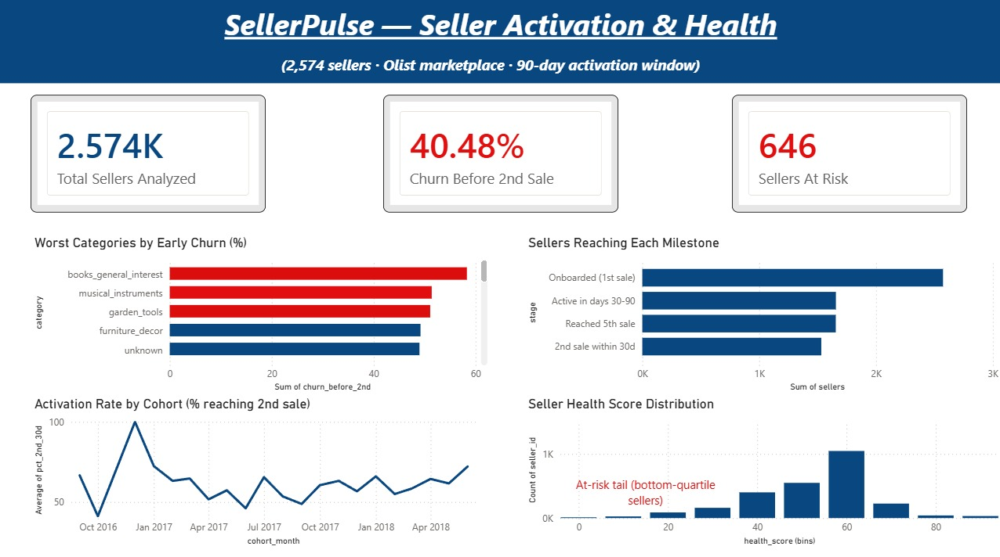

# SellerPulse — Marketplace Seller Activation & Churn Analysis

A product-analytics teardown of why new marketplace sellers go dormant in their first 90 days — ending in a data-backed PRD on what a product team should ship to fix it.

> **Headline finding:** 40.5% of new sellers churn before making a second sale within 30 days.

---

## What this project is

A self-initiated analysis of seller activation on an e-commerce marketplace, using the real **Olist Brazilian E-Commerce dataset** (~100K orders, ~3K sellers). It answers one question end to end:

**Why do new sellers stop selling after their first few orders, and what should the product team do about it?**

The project spans the full product-analytics workflow: data analysis → metric design → dashboarding → prioritized recommendations in a PRD.

## Key findings

- **40.5% of new sellers churn before a 2nd sale** within 30 days — nearly half of seller-acquisition effort produces no durable seller.
- **Early churn concentrates in low-repeat-purchase categories** — books (58%), musical instruments (51%), garden tools (51%). This reframes early churn as *two* problems: a seller-readiness problem and a category-demand problem, each needing a different intervention.
- **A 0–100 seller-health score** (weighted toward recency and order velocity as leading churn indicators) flags **646 at-risk sellers (~25%)** for proactive intervention within their first 30 days.

## What's in this repo

| File | What it is |
|------|-----------|
| `SellerPulse_analysis.ipynb` | The full analysis: seller lifecycle funnel, monthly cohorts, the health score, at-risk flagging, and dashboard exports. Handles observation censoring so 90-day retention isn't understated. |
| `SellerPulse_PRD.md` | The product requirements doc: problem framing, findings, a RICE-prioritized set of interventions, and a North Star + guardrail metrics framework. |
| `dashboard.png` | The Power BI dashboard (KPIs, milestone funnel, worst categories, cohort trend, health-score distribution). |
| `/exports` | Clean CSVs output by the notebook and used to build the dashboard. |

## The seller-health score

A composite 0–100 score built from four signals, each normalized and weighted:

| Signal | Weight | Rationale |
|--------|--------|-----------|
| Recency (days since last sale) | 0.30 | Strongest leading indicator of churn — going quiet is the earliest warning. |
| Order velocity | 0.30 | Momentum; sellers gaining velocity build the order base that keeps them active. |
| Delivery SLA | 0.20 | Quality/reliability signal; matters but lags activity. |
| Review score | 0.20 | Quality signal; important for long-term value, weaker short-term churn predictor. |

The score weights **activity signals above quality signals** because its job is to *predict churn* — a seller can earn a perfect review on one sale and still go dormant, so recency and velocity are more direct early-warning signals than reviews and delivery.

## How to reproduce

1. Download the [Olist Brazilian E-Commerce dataset](https://www.kaggle.com/datasets/olistbr/brazilian-ecommerce) from Kaggle.
2. Put the CSVs in the same folder as the notebook (or mount via Google Drive in Colab).
3. Run `SellerPulse_analysis.ipynb` top to bottom. It outputs the analysis and the dashboard CSVs.
4. Load the exported CSVs into Power BI to rebuild the dashboard.

## Limitations

Olist records a seller's first *sale*, not signup, so "activation" is measured from first sale onward — true signup-to-first-sale churn is invisible here and would likely make total early churn higher. The dataset is historical (2016–2018), so patterns are illustrative of marketplace dynamics rather than current.

---

*Built as a product-analytics project exploring marketplace seller operations, retention, and prioritization.*
